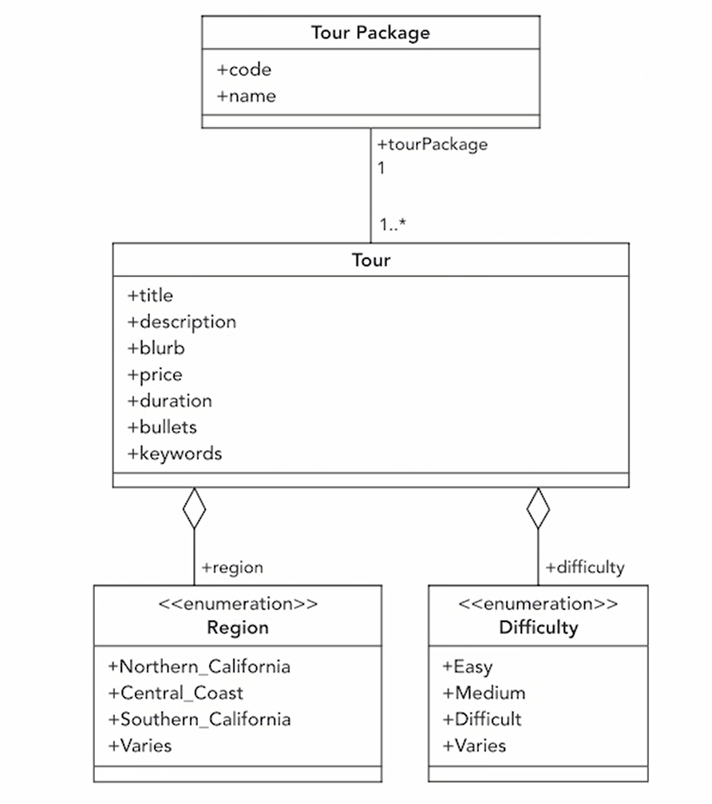

#RESTfull Spring Boot/Data/Web  Microservice with JPA:

1. Web includes Tomcat and Spring MVC
2. Rest repositories to expose Spring Data repositories over REST
3. Java Persistence API
4. H2 in memory database driver

#Hypermedia-Driven APIs:
Since I use Spring Boot and Data Rest, I do not need to creat controllers to
manage basic CRUD operations such as:
- POST /tourPackages {<request body>} =>
                           TourPackage tp = new TourPackage();
                           TourPackageRepository.save(TourPackage tourPackage);
- GET /tourPackages  => TourPackageRepository.findAll();
      /tourPackages/<code> => TourPackageRepository.findById(Spring code);
- PUT or PATCH /tourPackage/<code> {<request body>} =>
                                      TourPackage tp =
                                         TourPackageRepository.findById(String code);
                                      TourPackageRepository.save(tp);
- DELETE /tourPackages/<code> => TourPackageRepository.deleteById(String code);

To suppress unnecessary methods @RestResource(exported = false)
or class @RepositoryRestResource(exported = false) 

#Methods built-on "search":

There is a standard GET => /tourPackages/search/findByName{?name}
                           /tourPackages/search

#Paging and Sorting:

- GET with padding and sorting repository =>  /tours?size=3&page=1&sort=title,asc
            /tours/search/findByTourPackageCode?code=CC&size=3&page=1&sort=title,asc
#hal-browser:

http://localhost:8080/browser/index.html

#My DataBase Visual Schema

